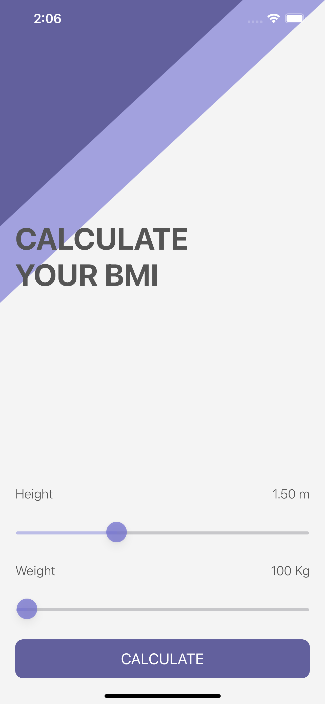
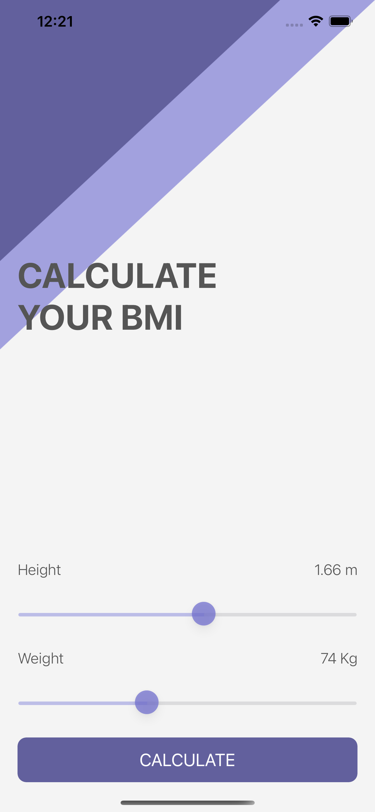
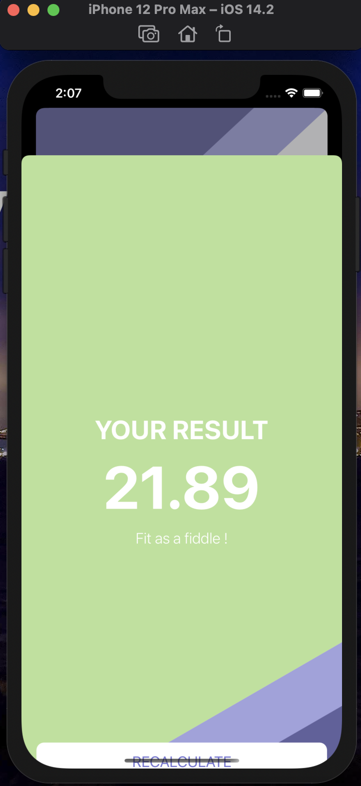
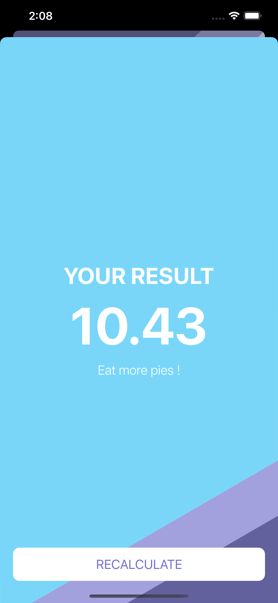
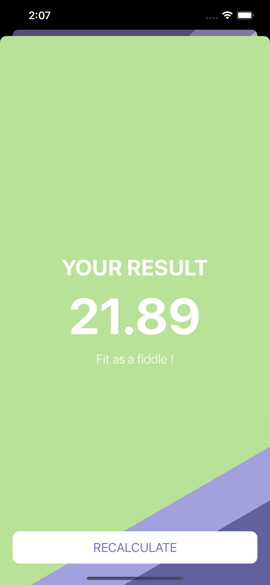
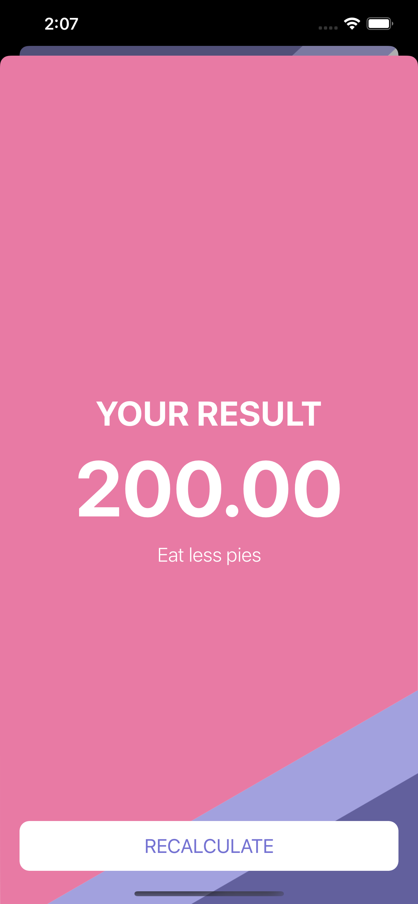

    

#  BMI Calculator

## What is it ?

* It is a Body Mass Index calculator. Based on the user’s weight and height it will calculate their body mass and give a piece of health advice depending on whether if they have eaten too many pies or if they need to eat more pies. 
* It is implemented using Swift5 and XCode. 
* Use of UI elements such as Labels and Buttons and changing them programmatically. 
* Use of MVC (Model-View-Controller) design pattern. 
* Implementation of Swift Struct and Classes.

## App Screenshots

 |  (Home Screen) |  (Setting Values) |  (Card Screen)|
 |:---:|:---:|:---:|
 
 | (Underfit Screen) | (Fit Screen) | (Unfit Screen) | 
 |:---:|:---:|:---:|

